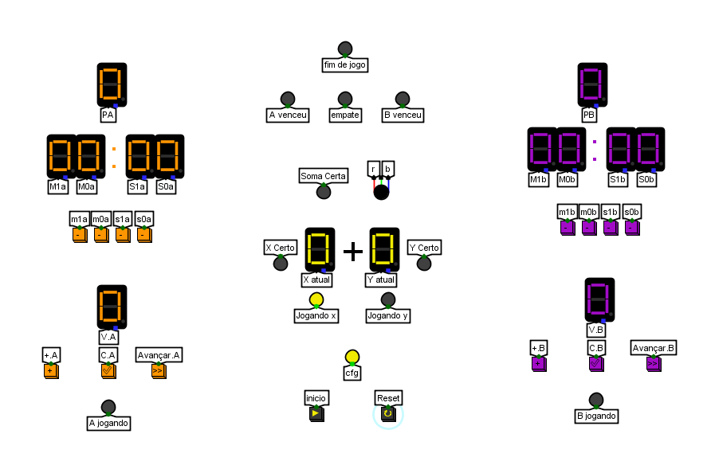

## Componentes Utilizados
Conexões: Distribuidores (Splitters), Pinos de Entrada/Saída, Extensor de Sinal (Bit Extender) e Túneis para organização das trilhas.

Portas Lógicas: Portas NOT, AND e OR para a lógica combinacional dos decodificadores e habilitação de saídas.

Circuitos Aritméticos: Somadores (Adders), Subtratores (Subtractors) e Comparadores (Comparators) de 4 e 5 bits.

Entrada/Saída: Botões interativos, LED RGB (Canais Vermelho e Azul) para indicação visual e Displays de 7 segmentos.

Memória e Sequencial: Contadores, Registradores (Flip-flops D), Demultiplexadores (DMX), Multiplexadores (MUX) e Gerador de valor aleatório (Random Generator).

## Vídeo gameplay

